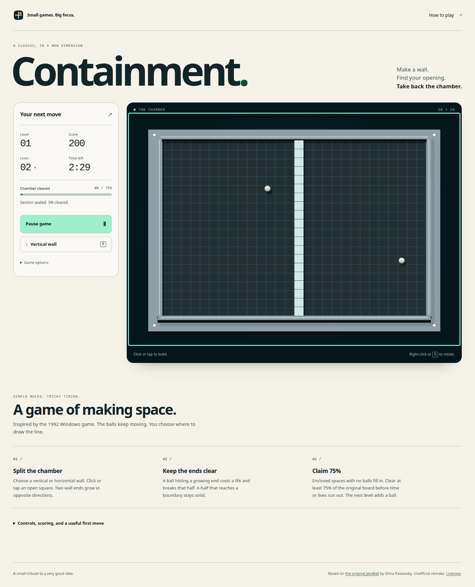

# Containment

[](https://github.com/mikezupper/containment/actions/workflows/ci.yml)
[](LICENSE)
[](.nvmrc)
[](tsconfig.json)
[](src/rendering/chamber.ts)
[](https://github.com/mikezupper/containment/issues)
[](https://github.com/mikezupper/containment/graphs/contributors)
[](https://github.com/mikezupper/containment/stargazers)

Build walls around bouncing balls. Claim 75% of the chamber before your time or lives
run out. Containment is a single-player browser game inspired by the 1992 Windows game
JezzBall, presented as a lit 3D chamber with a fixed camera and precise grid placement.



## Why this project exists

Containment brings a small, readable arcade idea to modern browsers while exploring
how to build several games without copying an entire application for each one.
Comparing the owner's Greed and Sabacc projects led to a clear boundary: each game
owns its rules and presentation; a small runtime can share snapshot observation and
interface wiring.

The result is both a playable game and an architecture experiment. The simulation
runs in two dimensions at 120 fixed ticks per second. Three.js adds materials and
lighting without changing the rules. Gyral connects typed player actions to a compact
interface. The [package assessment](docs/references/game-architecture-and-reusable-package.md)
records what proved reusable and what stayed game-specific.

## Play locally

You need **Node.js 24.15 or later within Node 24**, npm, and a browser with WebGL 2.
Use the version in `.nvmrc` if you have nvm installed.

```sh
git clone https://github.com/mikezupper/containment.git
cd containment
nvm use
npm ci
npm run dev
```

Open the URL printed by Vite, normally `http://127.0.0.1:5173`. No account, API key,
backend, or environment file is required. npm needs network access for uncached
dependencies; Gyral's pinned packages are included in the repository.

| Input | Action |
| --- | --- |
| Mouse click / touch tap | Place a wall in an open square |
| Right-click / wall-direction button | Rotate the next wall |
| Arrow keys, with the chamber focused | Move the keyboard aim; Shift moves four cells |
| Enter / Space | Build at the keyboard aim |
| R | Rotate the next wall |
| P / Escape | Pause or resume |

Each wall grows in two directions. A ball hitting a growing half breaks that half and
costs a life; a completed half stays solid. Empty enclosed regions fill in. Clearing
75% advances to a chamber with another ball. The page includes full instructions,
modern scoring choices, and a Slow pace option. See [the rules](docs/product/rules.md).

The game supports mouse, touch, and keyboard input, light and dark themes, optional
sound, and a local best score. Switching tabs or losing graphics pauses the run.
Graphics recovery retains the state and waits for an explicit resume. The moving
geometry remains a visual timing challenge; accessible controls do not establish
complete nonvisual playability.

## Architecture

| Layer | Owns |
| --- | --- |
| [`src/game`](src/game) | Pure deterministic rules, geometry, capture, collisions, scoring, progression |
| [`src/runtime`](src/runtime) | Session snapshots, subscriptions, action dispatch, fixed-step timing |
| [`src/rendering`](src/rendering) | Three.js scene, picking, resizing, graphics resources |
| [`src/app`](src/app) | Gyral controls and drivers, input, audio, chamber lifecycle |
| [`src/main.ts`](src/main.ts) | Browser composition, animation loop, storage, seed, visibility and cleanup |
| [`packages/game-runtime`](packages/game-runtime) | Dependency-free observation plus an optional Gyral session bridge |

Rules and runtime code do not read the DOM, storage, wall clock, or global randomness.
Reducers and views remain pure; side effects run through drivers. The renderer projects
snapshots and never decides game outcomes. Every subscription, event listener, timer,
and graphics resource has an owner and cleanup path. These boundaries are checked by
repository tooling. [ARCHITECTURE.md](ARCHITECTURE.md) explains the data flow.

Gyral `0.3.1-next.1` is vendored with source provenance and checksums. The private
`@local-games/runtime` workspace is MIT-licensed and built automatically before dev,
typechecking, and production builds. `private: true` prevents accidental npm publication;
it does not restrict contributions or source reuse. No npm package is published.

## Build and verify

```sh
npx playwright install chromium firefox webkit
npm run check
npm run verify:browser
npm run verify:compatibility
```

On Linux, `npx playwright install-deps` can install missing browser system libraries
and may require elevated installation privileges.

| Command | Purpose |
| --- | --- |
| `npm run dev` | Development server with hot reload |
| `npm run check` | Types, Gyral lint/templates, import boundaries, vendor hashes, tests, production build |
| `npm run test:unit` | DOM-free rules, session, and shared-runtime tests |
| `npm run test:browser` | Gyral and graphics lifecycle tests in Chromium |
| `npm run verify:browser` | Production Chromium play, accessibility, responsive checks, screenshots, bundle budget |
| `npm run verify:compatibility` | Chromium, Firefox, and WebKit touch paths and nine phone viewport sizes |
| `npm run build` | Compile the runtime workspace and create `dist/` |
| `npm run preview` | Preview `dist/` locally |

CI runs on a **manually started self-hosted runner**, never a GitHub-hosted runner.
Pushes to `main` queue checks. A maintainer reviews a public PR's exact commit and
starts its check run manually. Jobs wait while the runner is offline. Start it in the
foreground, let the queue drain, then stop it; no systemd service is used. See
[runner setup and operation](docs/self-hosted-ci.md).

Reports and screenshots are uploaded as workflow artifacts; local copies go in the
ignored `artifacts/` directory. Browser emulation does not establish physical-phone
or shipping Safari behavior. [The quality guide](docs/quality/README.md) records limits.

Two checks have prerequisites outside a normal clone:

- `npm run verify:hardware` requires installed Chrome, a graphical display, and an
  identifiable hardware GPU. It tests graphics recovery without software rendering.
- `npm run verify:package` checks the packed runtime against real Containment and Greed
  sessions. It requires the owner's Greed checkout at `../greed-dice-game`, or a path
  supplied through `GREED_REPO`. It is an optional integration check, separate from CI.

## Conventions and configuration

Use strict TypeScript, explicit typed actions, deterministic rules, and native HTML
controls. Keep Three.js in the rendering layer. CSS uses cascade layers, logical
properties, OKLCH tokens, and responsive grid/flex layouts. Verify interface changes
in a real browser and inspect screenshots. Update the relevant docs when behavior or
architecture changes. [CONTRIBUTING.md](CONTRIBUTING.md) covers review expectations.

| Setting | Default / purpose |
| --- | --- |
| Node version | `.nvmrc`; supported range is also declared in `package.json` |
| Vite base path | `/`; pass `--base=/containment/` when building for a project subpath |
| `CONTAINMENT_URL` | Optional existing server URL for production/browser verification |
| `JEZZBALL_URL` | Legacy fallback for `CONTAINMENT_URL` |
| `GREED_REPO` | Optional sibling checkout path for the packed-package integration check |
| Browser storage | Best score only, under the retained `jezzball.best.v1` key |

The game has no runtime secrets or server configuration. Gameplay tuning is explicit
in [the product rules](docs/product/rules.md) and the pure engine. Clearing browser
storage removes the local best score. The original storage key is retained so scores
survive the rename to Containment. Machine-specific environment files stay out of Git.

## Deployment

```sh
npm ci
npm run build
npm run preview
```

Upload the **contents of `dist/`** to an HTTPS static host. Keep the included runtime
license notices. There is no server process, database, or API to deploy; `vite preview`
is a local verification tool, not a production server.

For a GitHub Pages project site, build with `npm run build -- --base=/containment/`.
The included [Pages workflow](.github/workflows/pages.yml) runs manually on the local
runner after a maintainer enables Pages with GitHub Actions as its source. Creating
this repository does not activate a game deployment. See [deployment instructions](docs/deployment.md)
for base-path checks, hosting settings, and updates.

## Contribute

Bug fixes, rule tests, graphics recovery, mobile usability, documentation, and
accessibility improvements are welcome. Start with the [contribution guide](CONTRIBUTING.md),
[code of conduct](CODE_OF_CONDUCT.md), and [open issues](https://github.com/mikezupper/containment/issues).
Use [Discussions](https://github.com/mikezupper/containment/discussions) for questions.
Report vulnerabilities through the [security policy](SECURITY.md).

Human contributors can use GitHub issues and pull requests without installing Beads
or an AI coding tool. Maintainers use [Beads](.agents/skills/beads/SKILL.md) for local
implementation tracking. [AGENTS.md](AGENTS.md) maps conventions for coding agents;
the vendored skills are development guidance, not application dependencies.

## License and credits

Containment's original game code, runtime workspace, and project documentation use
the [MIT License](LICENSE). Vendored code and skills retain their own licenses; see
[third-party notices](THIRD_PARTY_NOTICES.md). Built sites include
[`third-party-notices.txt`](public/third-party-notices.txt).

The territory game is inspired by JezzBall, created by Dima Pavlovsky and published
by Microsoft in 1992. No original game code, artwork, or audio is bundled. Containment
is an independent project with its own timing, scoring, and presentation, and is not
affiliated with Microsoft. [Historical research](docs/references/jezzball-details.md)
separates original evidence from remake choices.
