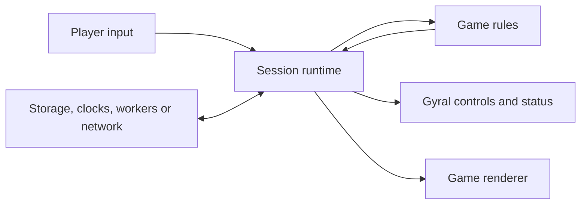

# Game architecture and a reusable npm package

Date: October 8, 2026.

Status: Containment is playable, and a private npm workspace now tests a small extraction against Containment and Greed's actual session code. Sabacc has been compared but has not adopted it. The package is an experiment for the owner's games; no public package, final name, or support contract has been selected.

Related reference: [Original JezzBall rules, appearance, and gameplay](jezzball-details.md).
Current implementation: [architecture](../../ARCHITECTURE.md) and [rules and tuning](../product/rules.md).

## Recommendation

Develop Containment with a clear separation between game rules, session/runtime code, and rendering. Extract a small reusable game runtime as real consumers establish its boundaries. Maintain a companion starter template for repository conventions and development tooling.

The current extraction covers snapshot observation and a Gyral session bridge. Each game owns its rules, state model, graphics, input meanings, clocks, browser services, and presentation. Gyral remains the UI framework; the package builds on its commands, drivers, subscriptions, and components.

## Existing projects inspected

| Project | Location | Relevant implementation |
| --- | --- | --- |
| Greed | `greed-dice-game` (owner-provided checkout) | Pure TypeScript rules, local/remote sessions, Rapier workers, Three.js trajectory playback, Zod wire schemas, Node/WebSocket/SQLite server |
| Sabacc | `starwars-run-sites/sabacc-game-site` (owner-provided checkout) | Effect-based rules, local/remote stores, Gyral controls, classic and Three.js views, event/snapshot playback, validated saves, Node multiplayer server |

Sabacc references below identify files in the owner's private checkout; they are not dependencies of Containment or links available to public contributors. Greed's public source is linked directly.

Both use TypeScript, Gyral, Vite, Vitest, real Chromium browser tests, and mechanically enforced architecture boundaries. At inspection, both consume vendored Gyral `0.3.1-next.1` artifacts. That is a description of their checked-in dependencies, not a recommendation to upgrade or publish that version.

Greed explicitly records its Sabacc influence in [its reference note](https://github.com/mikezupper/greed-game/blob/main/docs/references/sabacc.md): local/remote interfaces, room authority, reconnect tokens, validated messages, durable snapshots, graphics lifecycle ownership, and two-browser validation.

## The common architectural pattern



The responsibilities are:

- **Game rules:** decide valid transitions, outcomes, scores, and phases. They receive required inputs explicitly and avoid browser, storage, and network effects.
- **Session/runtime:** own the current state, order inputs, invoke rules or follow a remote authority, publish snapshots, and coordinate external services.
- **UI:** translate user interactions into commands and render controls, status, settings, and notices.
- **Renderer:** draw the state being presented and report input selections. It does not decide scores or authoritative outcomes.
- **Adapters:** perform storage, clocks, randomness, worker jobs, and networking at explicit boundaries.

Authoritative game state has one owner. Components may own temporary interaction state, such as a selection or an open dialog, while renderers may own visual interpolation and graphics resources.

The architecture supports alternative renderers and local/remote execution without requiring the rules to know about those choices.

## Comparison and extraction opportunities

| Concern | Sabacc | Greed | Recommended treatment |
| --- | --- | --- | --- |
| Rules engine | Effect domain; commands return game state and beats | Dependency-free TypeScript turn engine; physical roll results enter separately | Keep each game's engine; shared contracts should permit both approaches |
| State observation | Several cells combined into one UI snapshot | One observable session snapshot | Standardize the public session boundary |
| Animation | Playback of events paired with intermediate states | Playback of recorded physics frames | Retain separate playback strategies; extract scheduling only after another concrete consumer needs the same behavior |
| Graphics | Custom element owns a Three.js stage | Custom element owns a Three.js dice tray | Reuse ownership conventions and narrowly useful helpers |
| Persistence | Versioned, schema-validated saves | Validated table/roll saves and pending launches | Share storage mechanics; games provide formats and validation |
| Multiplayer | Per-player projections hide private cards and deck | Public table state, revisions, action receipts, pending physics work | Consider a later optional module with game-specific projection and command hooks |
| Validation | Architecture checks, unit tests, browser tests, scripted browser paths | Similar checks plus physics, container, and load validation | Share tooling and template conventions |

The similar observable implementations are not interchangeable without a contract. Sabacc's cell subscriptions signal changes, and its UI driver coalesces multiple changes into a snapshot. Greed's subscriptions immediately deliver the current snapshot and deliver later snapshots directly. An extraction must settle those semantics explicitly.

## Implemented session boundary

Greed's [Session interface](https://github.com/mikezupper/greed-game/blob/main/src/state/session.ts) is a useful starting point. Sabacc's table driver (`src/components/table-driver.ts`) shows the corresponding Gyral integration.

```ts
interface SnapshotSource<Snapshot> {
  get(): Snapshot;
  subscribe(listener: (snapshot: Snapshot) => void): () => void;
}
interface SessionPort<Snapshot, Input> extends SnapshotSource<Snapshot> {
  dispatch(input: Input): void | Promise<void>;
}
```

The private prototype uses these semantics:

1. `get()` returns the latest published snapshot.
2. `subscribe()` registers synchronously and delivers complete committed updates. It may emit immediately or only on changes. `observeSelection` normalizes either behavior to one initial selected value, then changed values, with caller-supplied equality or `Object.is`.
3. `dispatch()` submits an input to the session's ordered processing path. It does not promise synchronous completion of workers or remote actions.
4. Accepted changes, rejected commands, and connection problems are communicated through the game's documented snapshot/result model.
5. A snapshot is read-only to consumers. Components and renderers cannot mutate authoritative state through it.
6. Unsubscribing from `observeSelection` is idempotent and suppresses late callbacks. Session shutdown remains the host's responsibility; it is outside `SessionPort`. Both real sessions already expose their own `close()`.

Publish related state changes atomically. Consumers should not observe a new game state paired with an old event list or stale metadata because several internal cells updated separately.

The generic interface should not require seats, turns, cards, room codes, or scores. Those belong to the snapshot type of the particular game or optional adapter.

## Private package prototype

The workspace [packages/game-runtime](../../packages/game-runtime/README.md) uses the temporary name `@local-games/runtime`, version `0.0.0`, and `private: true`. Containment consumes it directly. `npm run verify:package` packs it and installs the archive into a separate temporary consumer, then typechecks and runs it with copied, unchanged Greed and Containment session sources in Chromium. The sibling repositories are not modified.

| Export | Containment consumer | Greed consumer | Sabacc assessment |
| --- | --- | --- | --- |
| `SnapshotSource<S>` | Session's `get()` and eager `subscribe()` | Existing session interface and eager cell | Existing cells have `get()` and change-only subscriptions; an aggregate still needs game-owned coalescing |
| `SessionPort<S, I>` | Containment session actions | Greed's real local session and typed moves | Possible adapter over its store; not implemented |
| `observeSelection` | HUD selection through the bridge | Match-stage observation in the packed consumer | Suitable after a coherent snapshot source exists |
| `createSessionBridge` | Production controls watch/action drivers | Packed consumer starts an actual local match | Existing table driver also coordinates several cells; retain that orchestration |

The `core` entry point has no runtime dependencies. The `gyral` entry point requires the exact optional peer `@gyral/core@0.3.1-next.1`, matching the current vendored artifacts. The packed check first loads the core with no Gyral installed, then installs the peer for the bridge proof. This validates package files, declarations, peer separation, real dispatch, and driver isolation. It does not validate Greed's dice worker or multiplayer, and it is not production adoption in Greed.

`createSessionBridge({ name, select, equal? })` supplies namespaced watch/action drivers, Gyral command factories, and `provide(element, session)`. Components own watch subscriptions; the browser host owns the provider binding and session shutdown. Containment keeps its 120 Hz clock, input, storage, audio, and WebGL recovery outside this package.

## Possible later package shape

The name `@your-scope/game-kit` is illustrative; no npm name or scope has been selected.

| Entry point | Intended responsibilities |
| --- | --- |
| `@your-scope/game-kit/core` | Session contracts and observation; random and resource helpers only after demonstrated reuse |
| `@your-scope/game-kit/browser` | Storage adapters, preferences, visibility handling, fixed-step browser scheduling |
| `@your-scope/game-kit/gyral` | Commands and subscriptions connecting a game session to Gyral components |
| `@your-scope/game-kit/testing` | Fake clocks and storage, scripted inputs, deterministic replay helpers |

Only the core observation contract and Gyral bridge exist today. Browser/testing entry points, seeded random, cleanup helpers, shared scheduling, and room infrastructure remain candidates. Their status belongs in Beads rather than being implied by this table.

Keep `core` independent of Gyral, Effect, Three.js, Rapier, and Node server APIs. Isolate browser imports from headless code, and isolate Gyral integration from the core entry point. Use explicit [package exports](https://nodejs.org/api/packages.html#subpath-exports) to define the supported public surface.

Separate entry points do not automatically prevent npm from installing declared dependencies. Heavy future integrations may justify separate packages; exports alone are not a dependency-isolation strategy.

The initial package should not take ownership of:

- Game-specific scoring, collision rules, card/dice models, or level generation.
- Three.js scenes, Rapier worlds, or a universal renderer.
- Another component system or another general-purpose effects framework.
- A mandatory server, database, lobby, or multiplayer protocol.
- Every game's visual theme and asset pipeline.

The current Gyral consumers use repository-local tarball dependencies. A distributable package needs a deliberate dependency strategy rather than inheriting paths into either game's vendor directory. Preserve those existing release artifacts during extraction.

## The companion starter template

Some of the strongest reuse opportunities are development conventions rather than runtime functions. A starter template should include:

- A directory structure separating rules, runtime, UI, rendering, and optional adapters.
- TypeScript, Vite, Vitest, and Chromium browser-test setup.
- Configurable checks enforcing dependency boundaries and rule-engine purity.
- A basic semantic HTML page, accessible controls, CSS tokens, and responsive layout conventions.
- Documentation locations for product rules, architecture, decisions, plans, and validation evidence.
- Standard scripts for checking and building the project.

Keep game-specific rules copy, branding, deployment configuration, credentials, and assets in each generated project. The goal is a consistent engineering approach with room for distinct games.

## Applying the architecture to Containment

Containment introduces a continuous simulation requirement that neither existing turn-based architecture fully covers.

Sabacc resolves a command and then presents its consequences as beats. Greed computes a physical roll and presents recorded motion. In Containment, the player can deploy walls while atoms and other wall construction are still moving. Input timing is part of the rules.

Implemented architecture:

| Layer | Containment responsibility |
| --- | --- |
| Rules/simulation | Atom movement, collision outcomes, wall-half growth and failure, area capture, lives, score, level progression, gameplay timer |
| Session/runtime | Current simulation state, synchronous actions, fixed-step advancement, pause/resume, graphics blocking, snapshot publication |
| Three.js renderer | Fixed-camera lit chamber, atoms, walls, construction indicators, placement preview, resource disposal |
| Gyral UI | Menus, settings, score, lives, time display, orientation controls, dialogs, notices |
| Browser adapters | Pointer/touch/keyboard events, animation frames, visibility, preferences, storage, audio |

The owner selected a modern 3D chamber with lighting and richer materials. Three.js presents planar rules through a fixed orthographic camera and raycasts onto the board plane for precise picking. Rapier is unnecessary for the game's circle/grid collisions. Rendering remains game-owned. Save/resume and replay are not implemented.

### Simulation and rendering cadence

The implemented simulation runs at 120 fixed steps per second, independent of display refresh rate. Each browser frame contributes at most 100 ms of accumulated time, bounding catch-up after a stall. Atom and construction speeds are explicit modern tuning values, not verified original-game timings.

The session accumulates elapsed time and executes fixed steps; the browser requests rendering at animation-frame cadence. Rules are deterministic for a given seed and input sequence. No render interpolation or serialized tick-input replay format is implemented.

The Gyral bridge filters HUD projections when visible values are unchanged. Score labels and settings do not re-render for every atom movement. The host writes only a changed best score to local storage, rather than a simulation snapshot every frame.

Animation callbacks generally follow the display refresh rate and pause in background tabs. Explicit timing avoids faster play on high-refresh displays. [Source: MDN's `requestAnimationFrame` documentation](https://developer.mozilla.org/en-US/docs/Web/API/Window/requestAnimationFrame).

Tab hiding, window blur, and graphics loss pause both movement and the countdown. Graphics recovery recreates the renderer and preserves the run; it requires explicit resume. A future remote game would need an explicit server-owned timing policy.

### Determinism and replay

A seed alone is insufficient to reproduce an interactive Containment session. A replay should identify:

- Initial seed and configuration.
- Ordered player inputs and their simulation ticks.
- Rules/simulation version.
- Any externally supplied outcomes that affect the game.

An exact resume also needs the current simulation and random-generator state, or enough replay history to reconstruct them. Define ordering for multiple inputs assigned to one tick. Determinism should be tested within the supported implementation rather than assumed across arbitrary future versions.

### Input and accessibility

Translate pointer, touch, and keyboard interactions into the same game commands. Provide a visible orientation control for touch users and a keyboard path for positioning and deploying the wallbuilder. Keep menus and status in semantic HTML.

Reduced-motion handling must preserve the moving atoms and wall growth essential to play. It can suppress decorative flashes, camera motion, and transition effects. Copying the dice game's behavior of immediately skipping to an animation's end would change Containment's gameplay.

## Multiplayer as a later extraction

Both inspected games provide useful room infrastructure, but Containment's initial single-player game does not require it.

Potential later shared capabilities include reconnects, command envelopes, revision checks, action deduplication, room lifecycle, and persistence-before-broadcast. Keep game-specific authorization, private/public state projection, turn rules, and asynchronous outcome handling behind explicit hooks.

Sabacc's private hands demonstrate why a room abstraction must support per-player projections. Greed's pending physics jobs demonstrate why late asynchronous results must be checked against the currently expected work. A generic room should preserve these properties without assuming every game has the same visibility or timing model.

Do not assume a turn-based snapshot protocol is sufficient for future real-time multiplayer. That would be a separate design exercise covering server ticks, latency, synchronization, and client presentation.

## Adoption criteria

The playable game and packed two-consumer experiment establish the first boundary. Keep the prototype small while Greed evaluates a production adoption and Sabacc evaluates its aggregate adapter. Shared browser services need a second consumer with matching semantics before extraction. Room infrastructure needs a separate game requirement and security review.

An [npm workspace](https://docs.npmjs.com/cli/v11/using-npm/workspaces) can link Containment and the developing package locally. This does not require moving the two existing games into a monorepo. Test a packed package in a separate consumer before a release, so workspace linking does not hide missing files or unresolved local dependencies.

Use versioned releases when consumers live in separate repositories. A first successful release should remove repeated supporting work from at least two games while allowing their engines and renderers to evolve independently.

## Open decisions

| Decision | Current recommendation or assumption |
| --- | --- |
| Primary audience | Owner's games first; confirm before committing to a public-library support contract |
| Package name and repository | Unselected |
| Initial scope | Session boundary and a few supporting adapters; no universal game-definition API |
| Gyral coupling | Dedicated adapter; framework-independent core |
| Effect adoption | Optional per game; no mandatory Effect dependency in core |
| Containment renderer | Implemented fixed-camera Three.js chamber; planar rules |
| Simulation cadence | Implemented 120 Hz; historical speed calibration remains separate |
| Initial networking | Local single-player; defer shared rooms |
| Save/replay formats | Game-owned, validated, versioned; define before implementing resume/replay |
| Publication | Not performed; needs production consumers, licensing, naming, and a stable Gyral dependency strategy |

## Evidence and source files

Sibling-repository links below assume the current `personal_brand` directory layout. They refer to the inspected working copies, not immutable commit permalinks.

- Greed [architecture](https://github.com/mikezupper/greed-game/blob/main/ARCHITECTURE.md), [Sabacc influence](https://github.com/mikezupper/greed-game/blob/main/docs/references/sabacc.md), [session interface](https://github.com/mikezupper/greed-game/blob/main/src/state/session.ts), [local runtime](https://github.com/mikezupper/greed-game/blob/main/src/state/local.ts), [remote runtime](https://github.com/mikezupper/greed-game/blob/main/src/state/remote.ts), and [Gyral drivers](https://github.com/mikezupper/greed-game/blob/main/src/app/drivers.ts).
- Greed [physics simulation](https://github.com/mikezupper/greed-game/blob/main/src/physics/simulate.ts), [renderer lifecycle](https://github.com/mikezupper/greed-game/blob/main/src/rendering/dice-tray.ts), [room implementation](https://github.com/mikezupper/greed-game/blob/main/src/server/room.ts), and [repository checks](https://github.com/mikezupper/greed-game/blob/main/scripts/check-repo.ts).
- Sabacc architecture (`ARCHITECTURE.md`), core beliefs (`docs/design-docs/core-beliefs.md`), store (`src/state/store.ts`), observable cells (`src/state/cell.ts`), and Gyral session bridge (`src/components/table-driver.ts`).
- Sabacc persistence (`src/state/persistence.ts`), remote store (`src/state/remote-store.ts`), beat playback (`src/presentation/playback.ts`), and graphics lifecycle (`src/scene/sabacc-stage.ts`).
- Official [npm workspaces](https://docs.npmjs.com/cli/v11/using-npm/workspaces), [Node package exports](https://nodejs.org/api/packages.html#subpath-exports), and [browser animation-frame documentation](https://developer.mozilla.org/en-US/docs/Web/API/Window/requestAnimationFrame).

During the initial architectural review, Sabacc's required `npm run check` passed: 18 test files, 155 tests, and the production build. The later packed prototype verifies real Greed and Containment sessions separately. Neither sibling repository's source or Beads status was changed. Current package evidence is generated at `artifacts/package/report.json`; game verification is recorded in [the quality guide](../quality/README.md).
